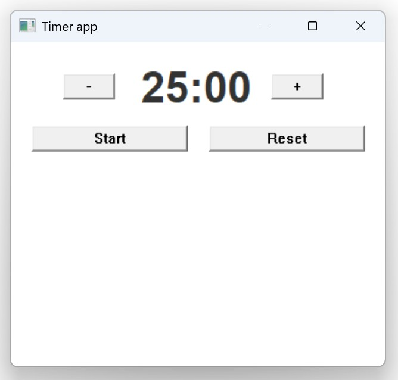

# Win32 timer app

This is a native Win32 application to explore low-level Windows GUI programming. Mostly to get familiar with API basics, window management and the messages queue.

This is a simple timer which can be started/paused, restarted, and add/subtract a minute from the current timer value. It plays a system sound when it is done. Looks like this:



## Instructions

This app is supposed to be compiled by MSVC and built by MSBuild, so you'll need to install Visual Studio. For simplicity, I only used a debug configuration, but it can be optimized for space as well with some compiler settings.

To build and run this app open `Developer Command Prompt for VS 2022` and execute:

```sh
msbuild app.proj /p:Platform=x64
.\x64\Debug\app.exe
```